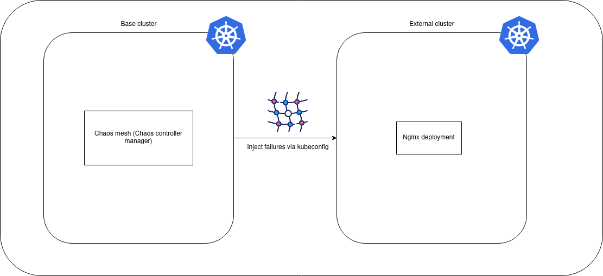

# Chaos Mesh Remote Cluster management demo
The aim of this demo is to showcase the capabilities of [Chaos Mesh](https://chaos-mesh.org/), and especially its capabilities of orchestrating Chaos Experiments in remote clusters using the remoteCluster CRD and KubeConfig to connect with the kube-api in the remote cluster.
The demo features scripts creating two multi node clusters using [kind](https://kind.sigs.k8s.io/), installing Chaos mesh on one of them, connecting the two clusters together, deploying containers to the remote cluster and then orchestrating the Chaos Experiment on the remote cluster.



# Quick start
Start by running the __kind-setup-clusters.sh__ script. 
```
./kind-setup-clusters.sh
```
Next, change context between the clusters (base and external) using this command:
```
kubectl config use kind-external
```
And observe the outcomes of the Chaos Experiment in the remote cluster. More Chaos Experiments will be added in the __K8s-yaml-files__ folder as support for remote experiments increases.

# Cleanup
After you're done with the experiments, remove the kind clusters (purging ALL kind clusters) using this script:
```
./teardown-kind.sh
```

# Requirements
To ensure the stability of the demo environment, make sure that you have these tools installed:
```
Docker >= 23.0.6
Kind >= v0.20.0
Helm >= 3.11.2
```

# Known issues
If the kubelet on the worker node on the External cluster will not join to the cluster, you might have reached maximum allowed number of concurrently opened files. To temporarily resolve this issue (until next OS restart), increase the hard limit:
```
sudo sysctl fs.inotify.max_user_watches=524288
sudo sysctl fs.inotify.max_user_instances=512
```
Alternatively, if you want these changes to be permanent, add these lines to /etc/sysctl.conf